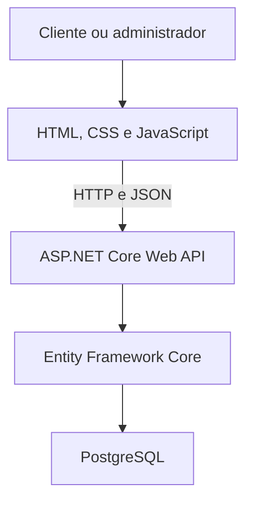
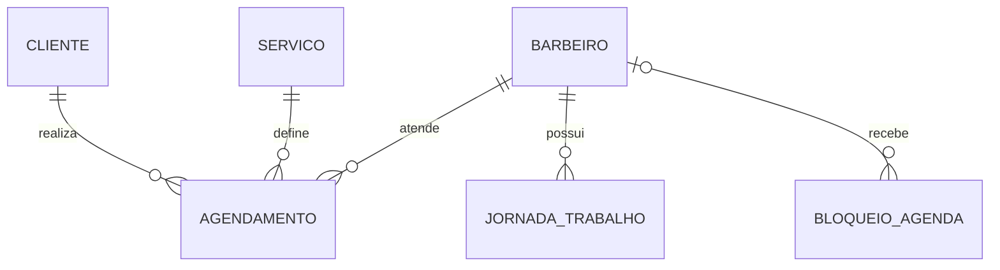

# Gueto Barbearia

> Sistema de agendamento desenvolvido para ajudar na organização dos clientes e horários da Gueto Barbearia.


## Sobre o projeto

Comecei este projeto com o objetivo de criar um sistema de agendamento simples e realmente útil para a barbearia de um amigo.

A ideia não é fazer um sistema enorme ou cheio de funções desnecessárias. Quero construir uma solução que facilite o agendamento dos clientes, ajude na organização da agenda e possa ser utilizada no dia a dia da barbearia.

Ao mesmo tempo, este projeto também faz parte dos meus estudos. Durante o desenvolvimento, pretendo colocar em prática o que estou aprendendo sobre front-end, C#, APIs, banco de dados, Git e desenvolvimento Full Stack.

## Status atual

O projeto está na fase de planejamento e levantamento de requisitos.

Antes de começar a programar, estou confirmando com o proprietário informações como:

- serviços e preços;
- duração de cada atendimento;
- quantidade de barbeiros;
- dias e horários de funcionamento;
- regras de cancelamento e remarcação;
- informações de contato;
- principais dificuldades na administração atual.

As funcionalidades e tecnologias descritas neste README representam o planejamento inicial e poderão ser ajustadas durante o desenvolvimento.

## Problema que pretendo resolver

Sistemas de agendamento precisam lidar com situações que vão além de apenas salvar o nome e o horário de um cliente.

Este projeto pretende evitar problemas comuns, como:

- dois clientes reservando o mesmo horário;
- agendamentos fora do funcionamento da barbearia;
- barbeiros aparecendo como disponíveis enquanto estão ocupados;
- serviços sendo marcados em horários menores do que sua duração;
- dificuldade para visualizar os atendimentos do dia;
- desorganização ao cancelar ou remarcar um atendimento.

## Objetivos

- Facilitar o agendamento pelo celular.
- Organizar os horários dos barbeiros.
- Centralizar informações básicas dos clientes.
- Permitir que o administrador acompanhe a agenda.
- Aplicar regras de negócio para evitar conflitos.
- Criar uma interface coerente com a identidade da Gueto Barbearia.
- Desenvolver um projeto Full Stack real para meu portfólio.

## MVP planejado

### Área do cliente

- Visualizar informações da barbearia.
- Consultar serviços, preços e duração.
- Conhecer os barbeiros disponíveis.
- Escolher um serviço.
- Escolher um barbeiro ou qualquer profissional disponível.
- Selecionar uma data.
- Visualizar somente horários realmente disponíveis.
- Informar nome e WhatsApp.
- Revisar os dados antes de confirmar.
- Receber uma confirmação visual do agendamento.

### Área administrativa

- Login protegido para o administrador.
- Visualização dos agendamentos do dia.
- Consulta dos próximos agendamentos.
- Filtro por data e barbeiro.
- Criação manual de agendamentos.
- Cancelamento e remarcação.
- Cadastro e edição de serviços.
- Cadastro e edição de barbeiros.
- Configuração dos horários de trabalho.
- Bloqueio de folgas, férias e horários indisponíveis.
- Lista simples de clientes.

## Fluxo de agendamento

O processo foi pensado para ser rápido e fácil de usar pelo celular:

1. Escolher o serviço.
2. Escolher o barbeiro.
3. Escolher o dia.
4. Escolher um horário disponível.
5. Informar nome e WhatsApp.
6. Revisar e confirmar o agendamento.

## Tecnologias planejadas

| Parte | Tecnologia | Objetivo |
|---|---|---|
| Front-end | HTML5 | Criar a estrutura das páginas e formulários |
| Front-end | CSS3 | Desenvolver o design responsivo e mobile-first |
| Front-end | JavaScript | Criar interações e consumir a API |
| Back-end | C# e ASP.NET Core Web API | Criar endpoints e regras de negócio |
| Plataforma | .NET 10 | Executar o back-end |
| Banco de dados | PostgreSQL | Armazenar clientes, serviços e agendamentos |
| ORM | Entity Framework Core | Integrar as classes C# com o banco de dados |
| Autenticação | ASP.NET Core Identity | Proteger o painel administrativo |
| Testes | xUnit | Testar as regras mais importantes |
| Versionamento | Git e GitHub | Registrar e organizar a evolução do projeto |

## Por que escolhi essa stack?

Quero seguir carreira principalmente com C# e .NET, então escolhi o ASP.NET Core para desenvolver o back-end e aprender a criar APIs utilizadas em projetos reais.

No front-end, decidi começar com HTML, CSS e JavaScript puro. Ainda estou fortalecendo minha base nessas tecnologias e, para a primeira versão, não vejo necessidade de adicionar React, Angular ou outro framework.

Escolhi o PostgreSQL porque é gratuito, profissional e pode ser utilizado tanto durante o desenvolvimento quanto futuramente na versão publicada do sistema.

O Entity Framework Core será utilizado para fazer a comunicação entre as classes C# e o banco, mas também pretendo aprender SQL para entender o que acontece por trás do ORM.

## Arquitetura planejada



O front-end será responsável pela interface e pela experiência do usuário. A API receberá as requisições, validará as regras do sistema e utilizará o Entity Framework Core para acessar o PostgreSQL.

Minha intenção é manter tudo em uma única aplicação na primeira versão. Assim, o ASP.NET Core poderá servir tanto os arquivos do front-end quanto os endpoints da API, deixando o desenvolvimento e a publicação mais simples.

## Modelo inicial do banco de dados

As principais entidades planejadas são:

| Entidade | Responsabilidade |
|---|---|
| Cliente | Guardar nome e telefone do cliente |
| Barbeiro | Representar os profissionais disponíveis |
| Serviço | Guardar nome, preço e duração dos serviços |
| Agendamento | Relacionar cliente, barbeiro, serviço, data e horário |
| Jornada de trabalho | Definir os dias e horários de cada barbeiro |
| Bloqueio de agenda | Registrar folgas e períodos indisponíveis |
| Usuário administrador | Controlar o acesso ao painel administrativo |



Não pretendo criar uma tabela cheia de horários prontos. Os horários disponíveis serão calculados a partir da jornada do barbeiro, dos bloqueios e dos agendamentos já existentes.

## Regras de negócio importantes

- O servidor será responsável por confirmar se um horário continua disponível.
- Um atendimento deverá caber completamente dentro do horário de trabalho.
- Agendamentos ativos do mesmo barbeiro não poderão se sobrepor.
- Bloqueios de agenda deverão remover os horários afetados.
- Agendamentos cancelados deixarão de ocupar o horário.
- Serviços e barbeiros antigos serão desativados em vez de apagados, preservando o histórico.
- Alterações no preço ou na duração de um serviço não deverão modificar agendamentos antigos.

## Estrutura planejada

```text
GuetoBarbearia/
├── src/
│   └── GuetoBarbearia.Api/
│       ├── Controllers/
│       ├── DTOs/
│       ├── Models/
│       ├── Services/
│       ├── Data/
│       ├── wwwroot/
│       │   ├── admin/
│       │   ├── assets/
│       │   ├── css/
│       │   ├── js/
│       │   └── index.html
│       └── Program.cs
├── tests/
├── docs/
└── README.md
```

Pretendo utilizar uma estrutura organizada, mas sem adicionar várias camadas apenas para deixar o projeto aparentemente mais complexo.

## Roadmap

- [x] Definir a ideia e o objetivo do projeto.
- [x] Escolher a stack inicial.
- [x] Confirmar os requisitos com o proprietário.
- [ ] Criar os fluxos e wireframes das telas.
- [ ] Criar o repositório e a estrutura inicial.
- [ ] Desenvolver a estrutura HTML.
- [ ] Criar o design responsivo com CSS.
- [ ] Montar o fluxo de agendamento com JavaScript e dados simulados.
- [ ] Aprender SQL e configurar o PostgreSQL.
- [ ] Criar a API com ASP.NET Core.
- [ ] Integrar o Entity Framework Core.
- [ ] Desenvolver as regras de disponibilidade.
- [ ] Conectar o front-end com a API.
- [ ] Criar o painel administrativo.
- [ ] Implementar autenticação.
- [ ] Criar testes para as regras críticas.
- [ ] Publicar o sistema.
- [ ] Adicionar screenshots e documentação final.

## Funcionalidades que podem ser adicionadas no futuro

Depois que a primeira versão estiver funcionando, algumas possibilidades são:

- confirmação por WhatsApp;
- lembretes de horário;
- histórico de atendimentos;
- programa de fidelidade;
- relatórios de serviços mais procurados;
- horários mais movimentados;
- dashboard de atendimentos;
- avaliações de clientes.

Essas funções não fazem parte do MVP. A prioridade é fazer o sistema básico funcionar bem antes de aumentar o projeto.

## Identidade visual

A identidade será inspirada no perfil da [Gueto Barbearia no Instagram](https://www.instagram.com/gueto_barbearia/), sem copiar o conteúdo do perfil.

A direção visual inicial utiliza:

- preto e grafite como base;
- branco ou off-white para melhorar a leitura;
- vermelho como cor de destaque;
- detalhes em cinza metálico;
- elementos urbanos usados com moderação;
- fotos reais dos trabalhos da barbearia.

Antes de definir a paleta final, ainda preciso receber a versão original do logotipo e confirmar com o proprietário quais materiais podem ser utilizados.

## Objetivo de aprendizado

Quero desenvolver este projeto de forma progressiva, entendendo cada parte em vez de apenas copiar uma aplicação pronta.

Ao final, pretendo ter praticado:

- HTML, CSS e JavaScript;
- responsividade e mobile-first;
- C# e ASP.NET Core;
- criação e consumo de APIs REST;
- SQL e PostgreSQL;
- Entity Framework Core;
- autenticação;
- regras de negócio;
- testes;
- Git e GitHub;
- publicação de uma aplicação Full Stack.

---

Este é um projeto pessoal em desenvolvimento, criado para aprendizado e portfólio, com a intenção de futuramente ser utilizado pela Gueto Barbearia.
